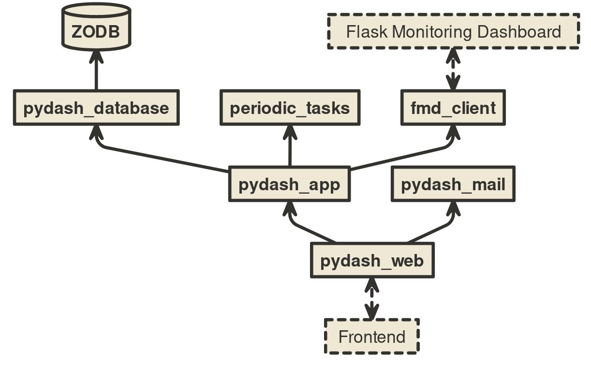
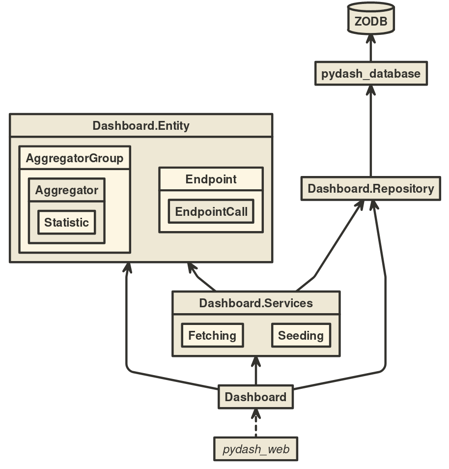

# PyDash.IO

Welcome!

<small>Wiebe-**Marten** Wijnja & **Arjan** Tilstra</small>

---

## What is it?

- Analytics & Metrics Dashboard for Python.
- All your Analytics, Metrics and uptime info in one place.
  -  _Flask-Monitoring Dashboard_ (FMD)

---

## Goals

- Snappy to use, Phone & Tablet-ready
  - Precalculate statistics
  - Single-Page Application: React
 

---

## Goals

- Extensible: A base for future work
  - Domain Driven Design
  - No extra dependencies at runtime except Python.

---

## Demo

---

## Back-End Choices

- Written in Python+Flask, to allow 'dogfooding'.
- Only runtime-dependency 'Python'.
  - ZODB Object Database (in Python).
- Concurrent using `multiprocessing` and hand-rolled task scheduler.

---

### Statistics Aggregator

- on-line statistics updating algorithm.
- 'DAG of Monoids'
- TDigest for accurate median of medians.

---

### Modularity

---

---

## Front-End Choices

- React, ES6
- Material-UI
- API client using JSON-AJAX calls with standardized success/error formats.

---

## The Team

- Two teams: 4 people front-end, 4 (later 3) people back-end.
- Two Weekly meetings
- Planning Poker, stand-ups.

---

## Continuous Integration:

- Doctests
- Unit Tests
- Integration Tests (including automated Browser tests)
- Multicore, random order.
- Code Coverage

- Multifaceted build- and test-script.

- Travis CI for all PRs and pushes.

---

### Some Statistics

- ~1230 Commits
- ~1000 Man-Hours
- ~970 CI Builds
- ~450 Issues and PRs

---

- Three+ packages contributed back into the community
  - MultiIndexedCollection (Python)
  - Tasks Scheduler (Python)
  - Flask Monitoring Dashboard Client (Python)
  - ReactScripts with sounds support (JS)
  - Improved React Breadcrumbs (JS)

---

## Thanks!

- Team: Alberto, Arjan, Jeroen, Jeroen, Koen, Lars, Tom, Wiebe-Marten
- Customer: Patrick & Mircea
- TA: Patrick
